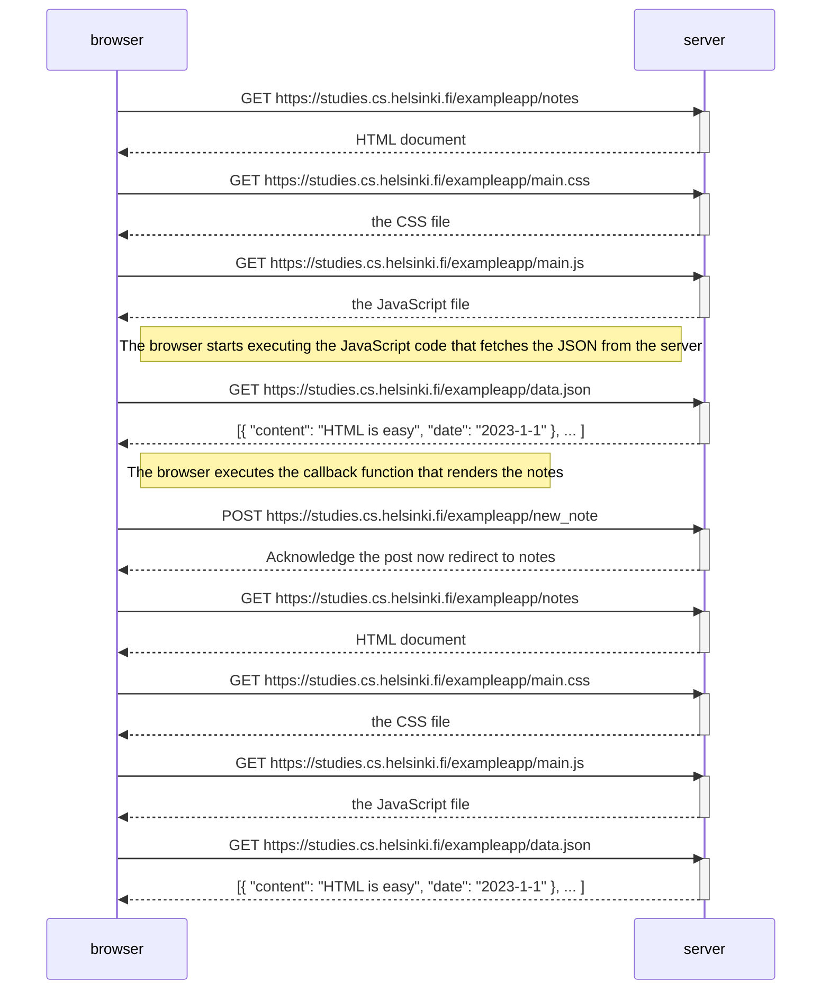
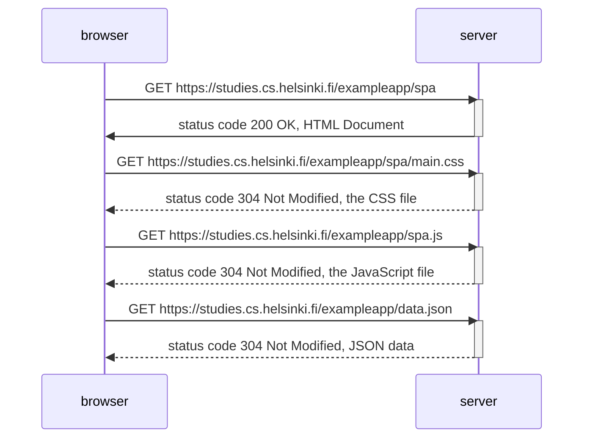
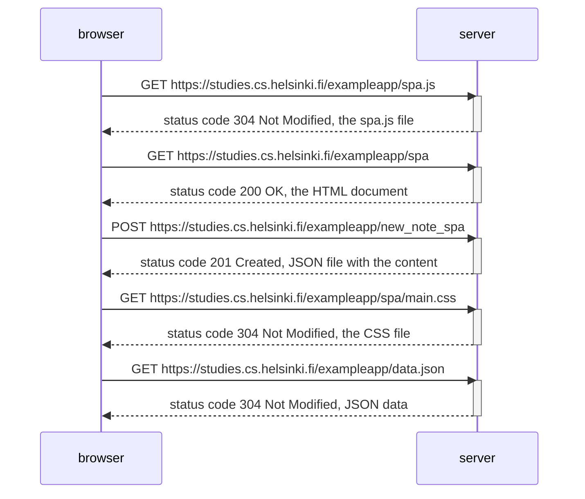

# Exercise 0.1 - New Note Diagram
Create a system sequence diagram of the chain of events caused by opening the page https://studies.cs.helsinki.fi/exampleapp/notes
depicting the situation where the user creates a new note on the page https://studies.cs.helsinki.fi/exampleapp/notes by writing something into the text field and clicking the submit button.
If necessary, show operations on the browser or on the server as comments on the diagram.

## Exercise 0.1 - Solution

# Exercise 0.2 - Single Page App Diagram
Create a diagram depicting the situation where the user goes to the single-page app version of the notes app at https://studies.cs.helsinki.fi/exampleapp/spa.

## Exercise 0.2 - Solution

# Exercise 0.3 - New Note in Single Page App Diagram
Create a diagram depicting the situation where the user creates a new note using the single-page version of the app.

## Exercise 0.3 - Solution

