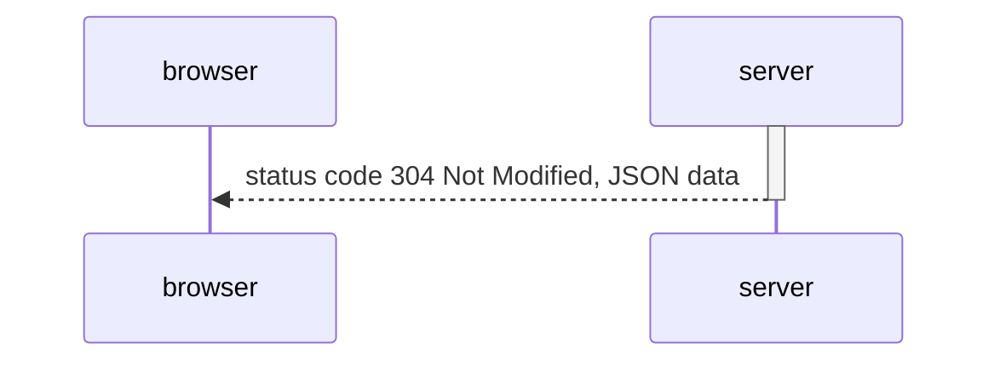
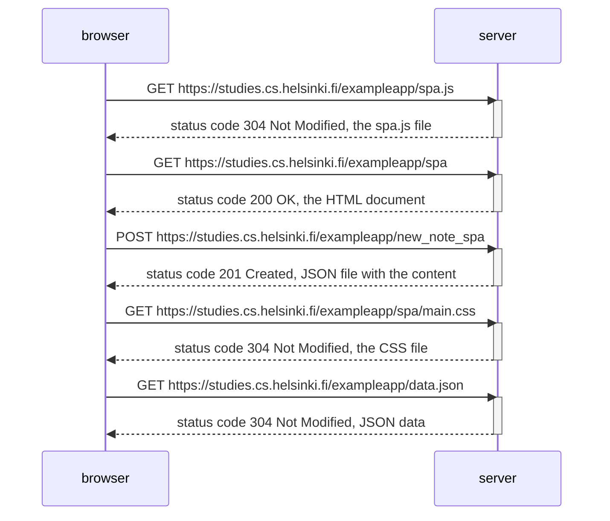

# Exercise 0.2 - Single Page App Diagram

Create a diagram depicting the situation where the user goes to the single-page app version of the notes app at https://studies.cs.helsinki.fi/exampleapp/spa.

## Exercise 0.2 - Solution

# Exercise 0.3 - New Note in Single Page App Diagram
Create a diagram depicting the situation where the user creates a new note using the single-page version of the app.

## Exercise 0.3 - Solution
